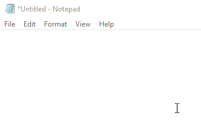

# ClipboardCalc

A project I created back in 2012. Allows you to stealthily do maths calculations on your PC.

If you copy some text that is a valid formula, enclosed by parenthesis `( ... )` for example: `(1 + 1)`, the application will paste the outcome of the copied formula in place.

The application rests in your tray area with a very un-telling icon.

Maths functions:
* pow(x, y) - calculates the power of `y` to `x`, basically `x ^ y`
* abs(x) - calculates the absolute value of `x`
* round(x) - rounds `x` to its nearest value with 0 decimals
* sqrt(x) - calculates square root of `x`

Maths symbols:
* pi - well... It's Pi, what do you want me to say? Here's a symbol or something: π